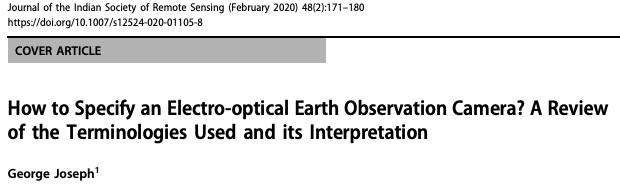
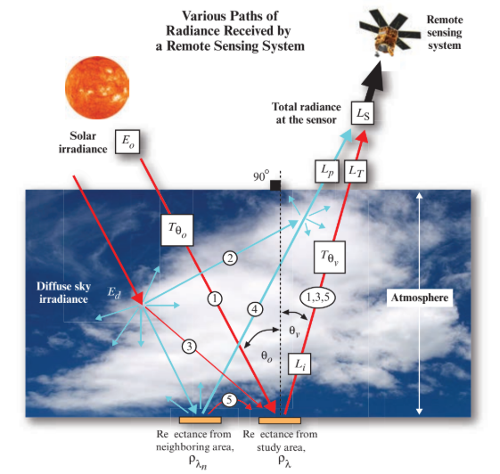
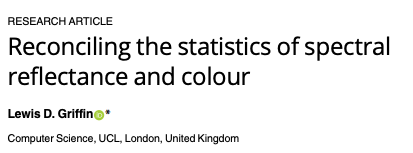
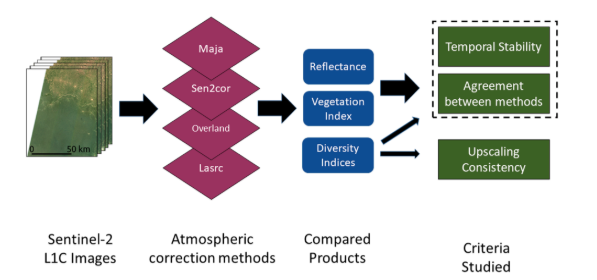
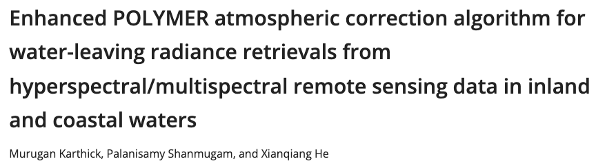

# Foundations

## How to Specify an Electro-optical Earth Observation Camera?

[Joseph, 2020](https://drive.google.com/file/d/1w_-q6zgObLj5sjvK-9gFFKBeoSB_wP2U/view?usp=sharing)

## How far can you measure?

[FLIR](https://drive.google.com/file/d/1Pz7UvOA-2IYy8g8FO2hWMdCfRaSRkl7n/view?usp=sharing)

## [Atmospheric correction](https://drive.google.com/file/d/1ddXi-7a5Z-_bnSRTo5qhUBUeWGhrRO0W/view?usp=drive_link)

## Reconciling statistics of reflectance and color

[Griffin, 2019](https://pmc.ncbi.nlm.nih.gov/articles/PMC6839875/pdf/pone.0223069.pdf)

# State of art

## Stability and consistency between atmospheric corrections

[Chraibi, 2022](https://drive.google.com/file/d/110oR9o8i8yr00NhYb1o3zGtLyyFEVj7g/view?usp=sharing)

## Atmospheric correction for water-leaving radiance retievals

[Karthick, 2024](https://opg.optica.org/oe/fulltext.cfm?uri=oe-32-5-7659)

## Atmospheric correction of vegetation reflectance 

[Qamar, 2023](https://pmc.ncbi.nlm.nih.gov/articles/PMC10385980/pdf/13007_2023_Article_1046.pdf)

