# What is spectral harmonization

## Reference

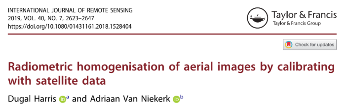

[Harris' paper](https://drive.google.com/file/d/1sSDjnUMMCPsAXbpRvub9g7mJFhxf4s0s/view?usp=sharing)

## Theory

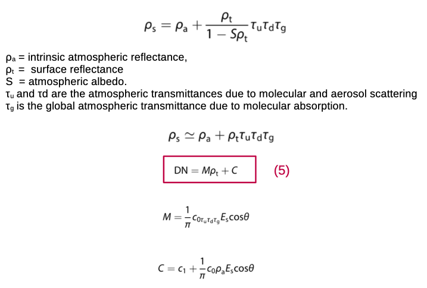

## Method

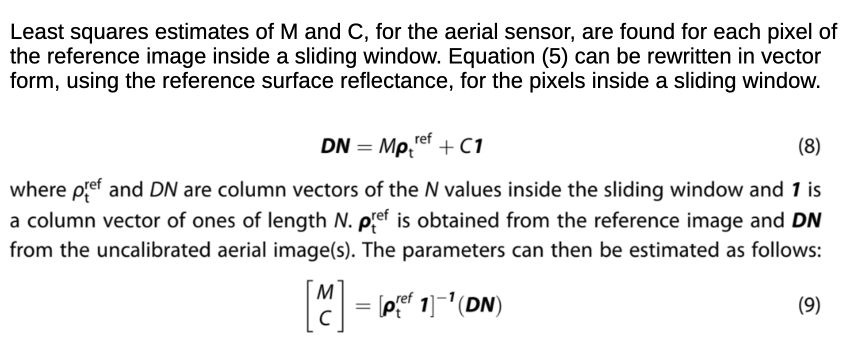

## Case study

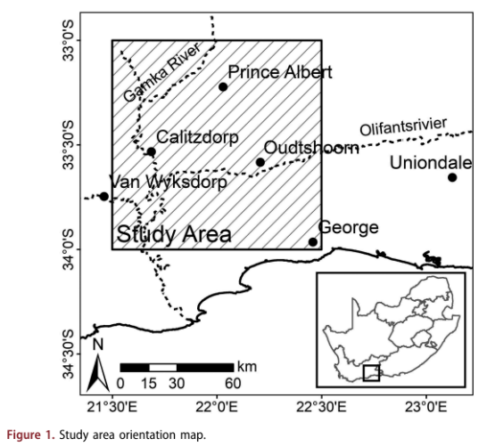

## Spectral response functions

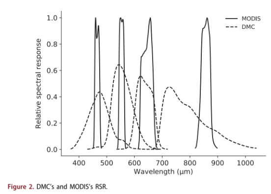

## Imagery extent

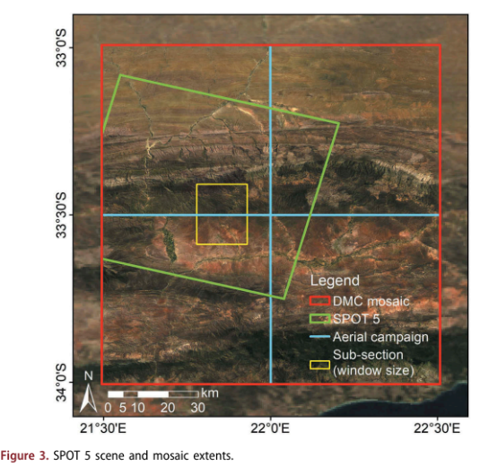

## Uncalibrated mosaic

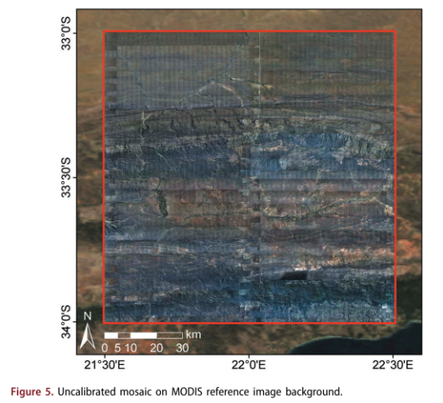

## Harmonized mosaic

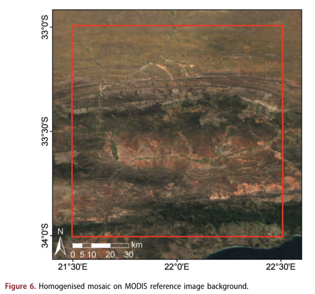

## Before - after

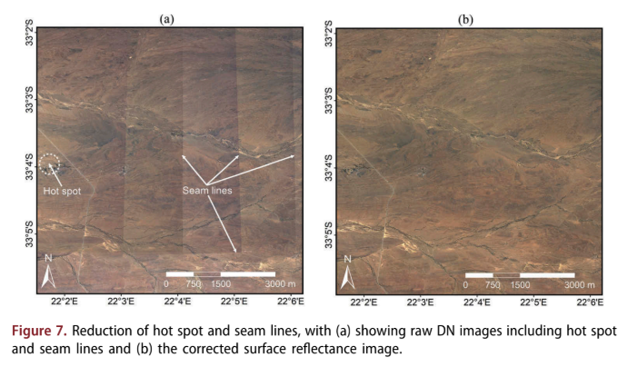

## After homogenization

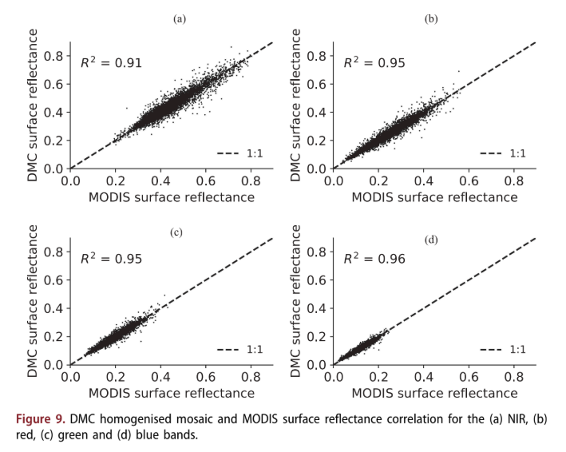

## After - DMC vs SPOT

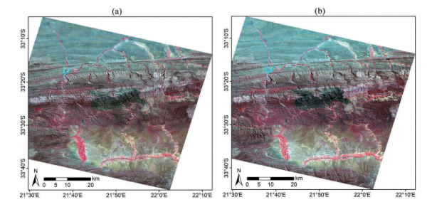

# An example of a harmonization tool

## *homomin* CLI and API

It allows adjusting for spatially varying atmospheric and anisotropic (BRDF) effects, 

It fuses drone or aerial data with satellite surface reflectance data. 

Manual reflectance measurements and target placements are not required.

## *homonim* uselfulness

- Pre-processing in quantitative mapping applications 

- Reducing seamlines and other visual artefacts in image mosaics

- The consistency of multi-temporal and multi-sensor data can be improved through its use.

# Let's practice

## [Homonim at github](https://homonim.readthedocs.io/en/stable/case_studies.html)

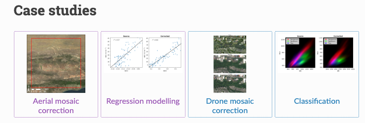

